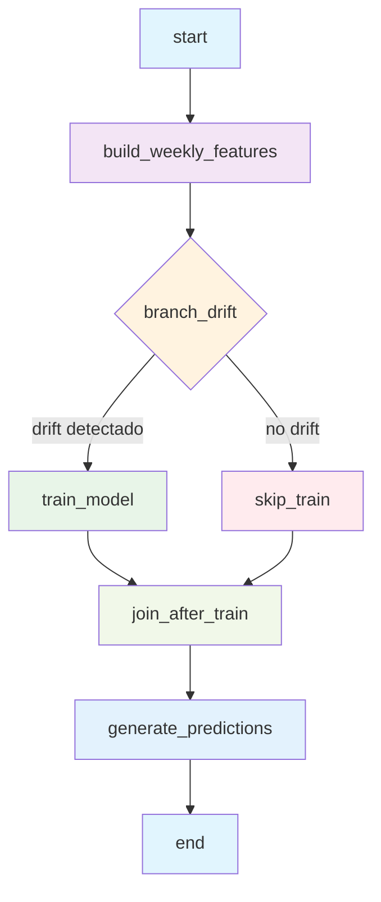

# Pipeline Productivo – SodAI Drinks (Airflow)

Este documento describe el pipeline productivo que se hizo en Apache Airflow como parte de la Entrega 2, para así poder agilizar el proceso de procesamiento, entrenamiento y predicción de los datos. 
El DAG incluye todo el flujo desde la preparación de datos hasta la generación de predicciones semanales, incluyendo detección de drift y reentrenamiento automático del modelo cuando es necesario hacerlo.


# 1. Descripción del DAG

El DAG implementa un flujo end-to-end que se ejecuta semanalmente (`@weekly`) y cumple con:

- Se introducen automáticamente los nuevos datos.
- Generación de features y reconstrucción del dataset semanal.
- Detección de drift entre la data utilizada para las semanas existentes y la nueva data posible.
- Reentrenamiento automático del modelo cuando se deba hacer.
- Generación de predicciones para la **semana siguiente a la última disponible (t+1)**.
- Persistencia de modelos, métricas y predicciones.

El DAG se llama sodai_pipeline_dag, debido a que es para la empresa sodai.


y su estructura es:

- `start`
- `build_weekly_features`
- `branch_drift`
    - `train_model` (si hay drift)
    - `skip_train` (si no hay drift)
- `join_after_train`
- `generate_predictions`
- `end`

---

# 2. Explicación Detallada de Cada Tarea

### **1. start**
Operador vacío que marca el inicio del pipeline.  
Se usa para mantener una estructura clara y estandarizada.

---

### **2. build_weekly_features**  
`PythonOperator`

En esta parte se ejetuta la función `build_weekly_features()` ubicada en `src/preprocessing.py`. La cual crea las semanas y las features correspondientes a ellas.

Esta etapa:

- Lee automáticamente todos los archivos `transacciones*.parquet` en `data/raw/`, incluyendo semanas nuevas.
- Construye la base **cliente × producto × semana**.
- Genera variables:
  - `compro_semana_pasada`
  - `promedio_compra`
- Realiza imputación, clipping, sin/cos para semana y encoding categórico.
- Crea el split temporal:  
  **train (1–36), val (37–44), test (45–53)**.
- Guarda `weekly_features.parquet` para las siguientes etapas.

Esta etapa asegura que el pipeline pueda integrar nuevos datos en la semana t+1 sin modificar código.

---

### **3. branch_drift**  
`BranchPythonOperator`

Ejecuta `detect_drift()` desde `src/drift.py`, el cual:

- Calcula PSI/IQR u otro método sobre las columnas numéricas.
- Compara la distribución de datos nuevos vs históricos.
- Retorna `True` si hay drift significativo.

Dependiendo del resultado, Airflow decide:

- `train_model` si es que hay drift  
- `skip_train` si es que no hay drift

Esto crea un flujo condicional y productivo dependiendo de los datos con los cuales se encuentre trabajando y el objetivo que se busque, simulando un sistema real.

---

### **4. train_model**
`PythonOperator`

Ejecuta `train_model()` desde `src/training.py`.

Esta etapa:

- Carga las features procesadas.
- Genera pipelines **preprocessing + XGBoost**.
- Ajusta hiperparámetros razonables (SMW incluido).
- Entrena el modelo con los datos más recientes.
- Registra métricas:
  - AUC
  - Average Precision
  - Precision/Recall
  - F1
- Guarda el modelo en:  
  `airflow/artifacts/models/xgb_pipeline.joblib`.
- Guarda métricas en:  
  `airflow/artifacts/metrics_train.json`.

Si no se ejecuta (porque no había drift), la tarea `skip_train` permite continuar el DAG.

---

### **5. skip_train**
`EmptyOperator`

Se ejecuta solo si no hay drift. Con este paso, se logra evitar reentrenamientos innecesarios.

---

### **6. join_after_train**
`EmptyOperator` con `TriggerRule.NONE_FAILED_MIN_ONE_SUCCESS`.

Permite sincronizar ambos flujos (con y sin reentrenamiento) para continuar el pipeline.

---

### **7. generate_predictions**
`PythonOperator`

Ejecuta `generate_predictions()` desde `src/predict.py`.

Esta etapa:

1. Carga `weekly_features.parquet`.
2. Determina la última semana (t) disponible.
3. Construye un dataset para la semana t+1.
4. Usa el modelo más actualizado (entrenado o previo).
5. Genera probabilidades `proba_compra` para cada cliente–producto.
6. Guarda un archivo único por semana:

airflow/artifacts/predictions/predicciones_semana_{t+1}.parquet


Esto completa el flujo **t → t+1 → t+2**, como se busca.

---

### **8. end**
Operador vacío que marca el fin del pipeline.

---

# 3. Diagrama de Flujo



---

# 4. Representación Visual del DAG en Airflow

El DAG se visualiza en la interfaz web de Airflow (http://localhost:8080) con la siguiente estructura:

```
[start] → [build_weekly_features] → [branch_drift] ⟨decision⟩
                                           ↓
                              ┌─────────────┴─────────────┐
                              ↓                           ↓
                      [train_model]              [skip_train]
                              ↓                           ↓
                              └─────────────┬─────────────┘
                                           ↓
                                [join_after_train]
                                           ↓
                                [generate_predictions]
                                           ↓
                                        [end]
```

**Configuración del DAG:**
- **DAG ID**: `sodai_pipeline_dag`
- **Schedule**: `@weekly` (ejecuta cada semana)
- **Start Date**: 2024-01-01
- **Catchup**: False (no ejecuta para fechas pasadas)
- **Max Active Runs**: 1 (evita ejecuciones concurrentes)
- **Tags**: ["sodai", "mlops", "entrega2"]

---

# 5. Diseño para Futuros Datos

La arquitectura del pipeline fue diseñada para simular un entorno productivo real, donde semanalmente llegan nuevos datos y el sistema debe decidir si reentrenar o no, manteniendo la estabilidad del modelo en el tiempo. A continuación se detalla cómo se implementaron estos tres componentes clave.

## **5.1 Integración Automática de Nuevos Datos**

El pipeline está preparado para incorporar nuevas semanas de datos sin intervención manual.
Esto se logra gracias a la función `load_raw_data()` ubicada en `src/data_io.py`, la cual carga todos los archivos de transacciones que existan en la carpeta `data/raw/`:

```python
tx_files = sorted(RAW_DIR.glob("transacciones*.parquet"))
dfs = [pd.read_parquet(f) for f in tx_files]
transacciones = pd.concat(dfs, ignore_index=True)
```

**Ventajas del diseño:**
- **Escalabilidad**: Nuevos archivos se incorporan automáticamente
- **Flexibilidad**: Soporta cualquier nomenclatura `transacciones*.parquet`
- **Robustez**: Sin hard-coding de nombres de archivos específicos

**Ejemplo de incorporación:**
Si aparecen archivos nuevos como:
- `transacciones_2024_15.parquet`
- `transacciones_nuevos_datos.parquet`

El DAG los incorporará automáticamente en la próxima ejecución semanal, reconstruirá la base semanal utilizando todos los datos históricos + los nuevos y no requiere modificar código.

---

## **5.2 Detección de Drift entre Datos Antiguos y Nuevos**

El módulo `src/drift.py` implementa un sistema robusto de detección de data drift utilizando **Population Stability Index (PSI)**.

### **Metodología:**
```python
def detect_drift():
    # Cargar datos procesados
    df = pd.read_parquet(PROCESSED_DIR / "weekly_features.parquet")
    
    # Dividir en datasets temporal
    df_train = df[df['semana'] <= 36]     # Datos históricos
    df_test = df[df['semana'] > 44]       # Datos recientes
    
    # Calcular PSI por columna numérica
    psis = {}
    for col in numeric_columns:
        psis[col] = _psi(df_train[col], df_test[col])
    
    # Decisión basada en umbral
    psi_mean = np.mean(list(psis.values()))
    has_drift = psi_mean > DRIFT_THRESHOLD
    
    return has_drift
```

### **Métricas de Drift:**
- **PSI (Population Stability Index)**: Mide cambios en distribuciones
- **Umbral configurado**: `DRIFT_THRESHOLD = 0.2` (ajustable en `config.py`)
- **Columnas monitoreadas**: Variables numéricas de features

### **Lógica de Decisión:**
- **PSI < 0.1**: Sin drift (estabilidad)
- **0.1 ≤ PSI < 0.2**: Drift ligero (monitoreo)
- **PSI ≥ 0.2**: Drift significativo → **Reentrenamiento requerido**

---

## **5.3 Reentrenamiento Automático Condicional**

El DAG utiliza un `BranchPythonOperator` para crear flujo condicional inteligente:

```python
def _branch_drift_wrapper():
    has_drift = detect_drift()
    return "train_model" if has_drift else "skip_train"
```

### **Flujo de Reentrenamiento:**

**Escenario 1: CON Drift Detectado**
```
branch_drift → train_model → join_after_train → generate_predictions
```
- Se ejecuta entrenamiento completo
- Se generan nuevas métricas
- Se guarda nuevo modelo optimizado
- Pipeline continúa con modelo actualizado

**Escenario 2: SIN Drift Detectado**
```
branch_drift → skip_train → join_after_train → generate_predictions
```
- Se evita reentrenamiento innecesario
- Se mantiene modelo actual (estable)
- Se conservan recursos computacionales
- Pipeline continúa con modelo existente

### **Sincronización de Flujos:**
```python
join_after_train = EmptyOperator(
    task_id="join_after_train",
    trigger_rule=TriggerRule.NONE_FAILED_MIN_ONE_SUCCESS,
)
```
- **Trigger Rule**: Permite que el pipeline continue independientemente de qué rama se ejecutó
- **Robustez**: Evita fallos si una rama no se ejecuta

---

## **5.4 Generación de Predicciones para la Semana Siguiente (t+1)**

La etapa final `generate_predictions` implementa un sistema de predicción prospectiva:

### **Proceso técnico:**
1. **Detección automática de última semana disponible:**
   ```python
   max_semana = df['semana'].max()  # t
   next_semana = max_semana + 1     # t+1
   ```

2. **Construcción de base de scoring:**
   ```python
   # Crear combinaciones cliente × producto para semana t+1
   scoring_df = create_scoring_base(next_semana)
   ```

3. **Aplicación del modelo más reciente:**
   ```python
   # Cargar modelo (entrenado o existente)
   model = load_model()
   predictions = model.predict_proba(scoring_df)
   ```

4. **Persistencia con timestamping:**
   ```python
   output_path = f"artifacts/predictions/predicciones_semana_{next_semana}.parquet"
   predictions_df.to_parquet(output_path)
   ```

### **Ventajas del diseño prospectivo:**
- **Predicción real**: Siempre para semana futura (t+1)
- **Actualización continua**: Cada ejecución genera nueva semana
- **Trazabilidad**: Archivos separados por semana
- **Flexibilidad**: Se adapta automáticamente a nuevos datos

### **Ejemplo de flujo temporal:**
```
Semana actual en datos: 53
↓
Pipeline detecta: max_semana = 53
↓
Genera predicciones para: semana 54
↓
Guarda: predicciones_semana_54.parquet
↓
Próxima ejecución con datos de semana 54:
→ Genera predicciones para semana 55
```

---

# 7. Estructura de Archivos y Artefactos

## **Datos Generados por el Pipeline:**

```
airflow/
├── data/
│   ├── raw/                              # Datos de entrada
│   │   ├── transacciones*.parquet       # Datos históricos + nuevos
│   │   ├── clientes.parquet
│   │   └── productos.parquet
│   └── processed/
│       └── weekly_features.parquet      # Features procesadas
├── artifacts/
│   ├── models/
│   │   └── xgb_best.pkl                # Modelo entrenado
│   ├── metrics_train.json               # Métricas de entrenamiento
│   └── predictions/
│       └── predicciones_semana_*.parquet # Predicciones por semana
└── logs/
    └── dag_id=sodai_pipeline_dag/       # Logs de ejecución
```

## **Métricas y Monitoreo:**

El archivo `metrics_train.json` contiene:
```json
{
  "auc": 0.85,
  "average_precision": 0.72,
  "precision": 0.68,
  "recall": 0.74,
  "f1": 0.71,
  "training_timestamp": "2024-11-19T10:30:00Z",
  "model_version": "xgb_v1.2"
}
```

---

# 8. Interpretabilidad del Modelo con SHAP

## **Análisis de Interpretabilidad Automatizado**

El pipeline genera automáticamente **gráficos de interpretabilidad completos** utilizando SHAP (SHapley Additive exPlanations) durante cada entrenamiento.

### **Gráficos SHAP Generados:**

#### **📊 1. SHAP Summary Plot (Beeswarm)**
- **Archivo**: `artifacts/plots/shap_summary_beeswarm.png`
- **Propósito**: Muestra el impacto de cada feature en todas las predicciones
- **Interpretación**: Dispersión de colores indica variabilidad del impacto por feature

#### **📈 2. SHAP Summary Plot (Bar)**
- **Archivo**: `artifacts/plots/shap_summary_bar.png`  
- **Propósito**: Ranking de importancia basado en valores absolutos promedio
- **Interpretación**: Features ordenadas por impacto real en predicciones

#### **🔄 3. SHAP Waterfall Plots**
- **Archivos**: 
  - `shap_waterfall_positive.png` (caso predicción positiva)
  - `shap_waterfall_negative.png` (caso predicción negativa)
- **Propósito**: Explica predicciones individuales paso a paso
- **Interpretación**: Cómo cada feature contribuye a la predicción final

#### **⚡ 4. SHAP Force Plot**
- **Archivo**: `artifacts/plots/shap_force_plot.png`
- **Propósito**: Múltiples explicaciones individuales simultáneas
- **Interpretación**: Visualización compacta de factores de decisión

#### **📉 5. SHAP Partial Dependence Plots**
- **Archivo**: `artifacts/plots/shap_partial_dependence.png`
- **Propósito**: Relación entre top 3 features y predicciones
- **Interpretación**: Comportamiento no lineal y umbrales de decisión

### **Información SHAP en Tracking:**

```json
{
  "interpretability": {
    "shap_feature_importance": [
      {"feature": "promedio_compra", "mean_abs_shap": 0.245},
      {"feature": "compro_semana_pasada", "mean_abs_shap": 0.189}
    ],
    "shap_expected_value": 0.0288,
    "shap_sample_size": 200,
    "shap_status": "success"
  }
}
```

### **Características Técnicas:**
- **Optimización**: Muestra de 200 observaciones para balance representatividad/eficiencia
- **Robustez**: Manejo automático de errores con fallbacks
- **Compatibilidad**: Detección automática de disponibilidad de SHAP
- **Calidad**: Gráficos publication-ready con alta resolución (300 DPI)

---

# 9. Consideraciones Técnicas y MLOps

## **Robustez del Sistema:**
- **Idempotencia**: Ejecutar múltiples veces el mismo día no genera errores
- **Recuperación**: Si falla una tarea, se puede reanudar desde ese punto
- **Logging**: Trazabilidad completa de cada ejecución
- **Versionado**: Modelos con timestamping automático

## **Escalabilidad:**
- **Datos crecientes**: Soporta volúmenes incrementales sin modificación
- **Distribución**: Docker permite despliegue en múltiples entornos
- **Paralelización**: Tareas independientes pueden ejecutarse en paralelo
- **Recursos**: Control de memoria y CPU via Docker Compose

## **Configuración Productiva:**
- **Schedule**: `@weekly` - Ejecuta automáticamente cada semana
- **Retries**: 1 intento adicional si falla una tarea
- **Timeout**: 5 minutos de delay entre reintentos
- **Max Active Runs**: 1 - Evita ejecuciones concurrentes
- **Catchup**: False - No ejecuta para fechas pasadas al activar

---

# 10. Conclusiones

Este pipeline de MLOps implementa un sistema productivo completo que:

1. **Automatiza el flujo completo** desde ingesta de datos hasta predicciones
2. **Detecta cambios en los datos** mediante técnicas de drift detection
3. **Reentrenamiento inteligente** solo cuando es necesario
4. **Escalabilidad** para incorporar nuevos datos sin modificaciones
5. **Monitoreo y trazabilidad** completa de todas las ejecuciones

El diseño simula un entorno productivo real donde cada semana:
- Llegan nuevos datos de transacciones
- El sistema evalúa la necesidad de reentrenar
- Se generan predicciones para la semana siguiente
- Todo queda documentado y trackeado

La implementación en Airflow permite un control granular del flujo, manejo de errores, y facilita el mantenimiento del sistema en producción.

---

## **Autores**
- Grupo SodAI - Entrega 2
- MDS7202 - Laboratorio de Programación Científica para Ciencia de Datos
- Noviembre 2024

---

Guardar las predicciones en: artifacts/predictions/predicciones_semana_{t+1}.parquet

---

# 6. Configuración y Ejecución del Pipeline

## **Prerrequisitos**

1. **Docker y Docker Compose instalados**
2. **Estructura de archivos en `/opt/airflow/`**:
   ```
   airflow/
   ├── dags/sodai_pipeline.py
   ├── src/
   │   ├── config.py
   │   ├── data_io.py
   │   ├── preprocessing.py
   │   ├── training.py
   │   ├── predict.py
   │   └── drift.py
   ├── data/
   │   ├── raw/transacciones*.parquet
   │   └── processed/
   └── artifacts/
       ├── models/
       ├── metrics_train.json
       └── predictions/
   ```

## **Comandos de Ejecución**

```bash
# 1. Levantar servicios de Airflow
cd airflow/
docker-compose up -d

# 2. Acceder a la interfaz web
# http://localhost:8080
# Usuario: airflow / Contraseña: airflow

# 3. Activar el DAG desde la interfaz web
# o manualmente ejecutar:
docker exec -it airflow-webserver airflow dags trigger sodai_pipeline_dag
```

## **Monitoreo y Logs**

- **Interfaz Web**: http://localhost:8080
- **Logs por tarea**: Accesibles desde la interfaz de Airflow
- **Archivos de log**: `airflow/logs/dag_id=sodai_pipeline_dag/`
- **Métricas**: `airflow/artifacts/metrics_train.json`
- **Modelos**: `airflow/artifacts/models/xgb_best.pkl`

---
