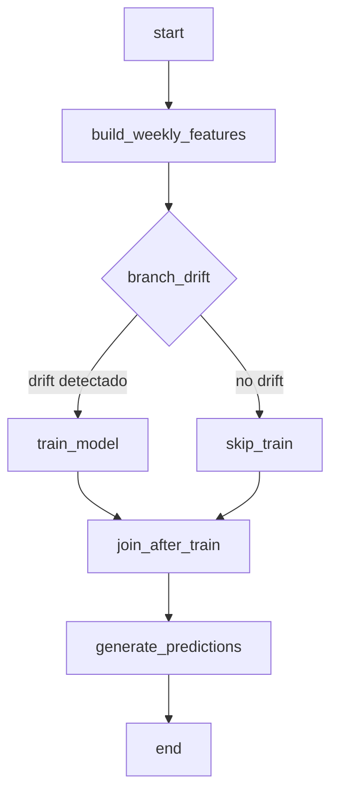

# Pipeline Productivo SodAI Drinks 

Este documento describe el pipeline productivo implementado en Apache Airflow como parte de la Entrega 2, diseñado para automatizar el proceso de procesamiento, entrenamiento y predicción de datos. El DAG incluye todo el flujo desde la preparación de datos hasta la generación de predicciones semanales, incluyendo detección de drift y reentrenamiento automático del modelo cuando es necesario.

---

# 1. Descripción del DAG

El DAG implementa un flujo end-to-end que se ejecuta semanalmente (`@weekly`) y cumple con las siguientes funcionalidades:

- Ingesta automática de nuevos datos
- Generación de features y reconstrucción del dataset semanal
- Detección de drift entre datos históricos y nuevos
- Reentrenamiento automático del modelo cuando es requerido
- Generación de predicciones para la semana siguiente a la última disponible (t+1)
- Persistencia de modelos, métricas y predicciones

El DAG se denomina `sodai_pipeline_dag` y su estructura de tareas es la siguiente:

- `start`
- `build_weekly_features`
- `branch_drift`
    - `train_model` (si hay drift)
    - `skip_train` (si no hay drift)
- `join_after_train`
- `generate_predictions`
- `end`

---

# 2. Explicación Detallada de Cada Tarea

### 1. start
Operador vacío que marca el inicio del pipeline. Se utiliza para mantener una estructura clara y estandarizada del flujo de trabajo.

### 2. build_weekly_features  
`PythonOperator` que ejecuta la función `build_weekly_features()` ubicada en `src/preprocessing.py`.

Esta etapa realiza las siguientes operaciones:
- Lee automáticamente todos los archivos `transacciones*.parquet` en `data/raw/`, incluyendo datos de semanas nuevas
- Construye la base **cliente × producto × semana**
- Genera variables derivadas: `compro_semana_pasada` y `promedio_compra`
- Realiza imputación, clipping y encoding categórico
- Aplica transformaciones trigonométricas (sin/cos) para la variable semana
- Crea el split temporal: **train (1–36), val (37–44), test (45–53)**
- Guarda el archivo `weekly_features.parquet` para las etapas subsecuentes

Esta implementación permite que el pipeline integre nuevos datos en la semana t+1 sin requerir modificaciones de código.

### 3. branch_drift  
`BranchPythonOperator` que ejecuta `detect_drift()` desde `src/drift.py`.

El proceso de detección incluye:
- Cálculo de Population Stability Index (PSI) sobre columnas numéricas
- Comparación de distribuciones entre datos nuevos y datos históricos
- Evaluación contra umbral predefinido para determinar significancia del drift

Dependiendo del resultado, Airflow dirige el flujo hacia:
- `train_model` si se detecta drift significativo
- `skip_train` si no hay drift detectado

### 4. train_model
`PythonOperator` que ejecuta `train_model()` desde `src/training.py`.

Las operaciones incluyen:
- Carga de features procesadas
- Construcción de pipelines de preprocessing + XGBoost
- Optimización de hiperparámetros
- Entrenamiento del modelo con datos más recientes
- Cálculo y registro de métricas (AUC, Average Precision, F1, etc.)
- Persistencia del modelo en `artifacts/models/xgb_best.pkl`
- Guardado de métricas en `artifacts/metrics_train.json`

### 5. skip_train
`EmptyOperator` que se ejecuta únicamente cuando no se detecta drift, evitando reentrenamientos innecesarios y preservando recursos computacionales.

### 6. join_after_train
`EmptyOperator` con `TriggerRule.NONE_FAILED_MIN_ONE_SUCCESS` que sincroniza ambos flujos (con y sin reentrenamiento) permitiendo la continuación del pipeline.

### 7. generate_predictions
`PythonOperator` que ejecuta `generate_predictions()` desde `src/predict.py`.

El proceso incluye:
1. Carga del archivo `weekly_features.parquet`
2. Determinación de la última semana (t) disponible
3. Construcción del dataset para la semana t+1
4. Aplicación del modelo más actualizado
5. Generación de probabilidades `proba_compra` para cada combinación cliente-producto
6. Persistencia en formato `predicciones_semana_{t+1}.parquet`

### 8. end
Operador vacío que marca la finalización exitosa del pipeline.

---

# 3. Diagrama de Flujo



---

# 4. Representación Visual del DAG en Airflow

El DAG se visualiza en la interfaz web de Airflow (http://localhost:8080) con la siguiente estructura:

```
[start] → [build_weekly_features] → [branch_drift] <decision>
                                           ↓
                              ┌─────────────┴─────────────┐
                              ↓                           ↓
                      [train_model]              [skip_train]
                              ↓                           ↓
                              └─────────────┬─────────────┘
                                           ↓
                                [join_after_train]
                                           ↓
                                [generate_predictions]
                                           ↓
                                        [end]
```

**Configuración del DAG:**
- **DAG ID**: `sodai_pipeline_dag`
- **Schedule**: `@weekly` (ejecuta cada semana)
- **Start Date**: 2024-01-01
- **Catchup**: False (no ejecuta para fechas pasadas)
- **Max Active Runs**: 1 (evita ejecuciones concurrentes)
- **Tags**: ["sodai", "mlops", "entrega2"]


**Imagen del DAG:**


**Video de youtube ejecutando el DAG:**

https://youtu.be/qyNoT1GKsXo

---

# 5. Diseño para Futuros Datos

La arquitectura del pipeline simula un entorno productivo real donde semanalmente se incorporan nuevos datos y el sistema debe evaluar automáticamente la necesidad de reentrenamiento, manteniendo la estabilidad del modelo a lo largo del tiempo.

## 5.1 Integración Automática de Nuevos Datos

El pipeline incorpora nuevas semanas de datos sin intervención manual mediante la función `load_raw_data()` en `src/data_io.py`:

```python
tx_files = sorted(RAW_DIR.glob("transacciones*.parquet"))
dfs = [pd.read_parquet(f) for f in tx_files]
transacciones = pd.concat(dfs, ignore_index=True)
```

**Características del diseño:**
- **Escalabilidad**: Incorporación automática de nuevos archivos
- **Flexibilidad**: Soporte para cualquier nomenclatura `transacciones*.parquet`
- **Robustez**: Eliminación de dependencias de nombres específicos

## 5.2 Detección de Drift entre Datos Históricos y Nuevos

El módulo `src/drift.py` implementa detección de data drift utilizando **Population Stability Index (PSI)**:

```python
def detect_drift():
    df = pd.read_parquet(PROCESSED_DIR / "weekly_features.parquet")
    
    df_train = df[df['semana'] <= 36]     # Datos históricos
    df_test = df[df['semana'] > 44]       # Datos recientes
    
    psis = {}
    for col in numeric_columns:
        psis[col] = _psi(df_train[col], df_test[col])
    
    psi_mean = np.mean(list(psis.values()))
    has_drift = psi_mean > DRIFT_THRESHOLD
    
    return has_drift
```

**Métricas y umbrales:**
- **PSI < 0.1**: Sin drift (estabilidad)
- **0.1 ≤ PSI < 0.2**: Drift ligero (monitoreo)
- **PSI ≥ 0.2**: Drift significativo (reentrenamiento requerido)

## 5.3 Reentrenamiento Automático Condicional

El DAG utiliza un `BranchPythonOperator` para implementar flujo condicional:

**Escenario 1: CON Drift Detectado**
```
branch_drift → train_model → join_after_train → generate_predictions
```

**Escenario 2: SIN Drift Detectado**
```
branch_drift → skip_train → join_after_train → generate_predictions
```

## 5.4 Generación de Predicciones Prospectivas (t+1)

La etapa `generate_predictions` implementa predicción para la semana siguiente:

1. **Detección automática de última semana:** `max_semana = df['semana'].max()`
2. **Construcción de base de scoring** para semana `t+1`
3. **Aplicación del modelo más actualizado**
4. **Persistencia con timestamping:** `predicciones_semana_{next_semana}.parquet`

---

# 6. Estructura de Archivos y Artefactos

```
airflow/
├── data/
│   ├── raw/                              
│   │   ├── transacciones*.parquet       # Datos históricos + nuevos
│   │   ├── clientes.parquet
│   │   └── productos.parquet
│   └── processed/
│       └── weekly_features.parquet      
├── artifacts/
│   ├── models/
│   │   └── xgb_best.pkl                # Modelo entrenado
│   ├── metrics_train.json               # Métricas de entrenamiento
│   └── predictions/
│       └── predicciones_semana_*.parquet 
└── logs/
    └── dag_id=sodai_pipeline_dag/       # Logs de ejecución
```

---

# 7. Interpretabilidad del Modelo con SHAP

El pipeline genera automáticamente análisis de interpretabilidad utilizando SHAP durante cada entrenamiento:

**Gráficos generados:**
- `shap_summary_beeswarm.png`: Impacto de features en todas las predicciones
- `shap_summary_bar.png`: Ranking de importancia por valores absolutos
- `shap_waterfall_positive/negative.png`: Explicaciones individuales detalladas
- `shap_force_plot.png`: Visualizaciones compactas de factores de decisión
- `shap_partial_dependence.png`: Relaciones entre top features y predicciones

**Tracking de métricas SHAP:**
```json
{
  "interpretability": {
    "shap_feature_importance": [
      {"feature": "promedio_compra", "mean_abs_shap": 0.245},
      {"feature": "compro_semana_pasada", "mean_abs_shap": 0.189}
    ],
    "shap_expected_value": 0.0288,
    "shap_sample_size": 200,
    "shap_status": "success"
  }
}
```
---

# 8. Configuración y Ejecución

## Prerrequisitos
- Docker y Docker Compose instalados
- Estructura de archivos adecuada en directorio de trabajo

## Comandos de Ejecución

```bash
# Levantar servicios de Airflow
cd airflow/
docker-compose up -d

# Acceder a interfaz web
# http://localhost:8080
# Usuario: admin / Contraseña: admin

# Ejecutar DAG manualmente
docker exec -it airflow-webserver airflow dags trigger sodai_pipeline_dag
```

## Monitoreo y Logs
- **Interfaz Web**: http://localhost:8080
- **Logs detallados**: Accesibles desde la interfaz de Airflow
- **Archivos locales**: `airflow/logs/dag_id=sodai_pipeline_dag/`
- **Métricas**: `airflow/artifacts/metrics_train.json`
- **Modelos**: `airflow/artifacts/models/xgb_best.pkl`

---

# 9. Conclusiones

Este pipeline de MLOps implementa un sistema productivo que automatiza el flujo completo desde ingesta hasta predicciones, detecta cambios en distribuciones de datos, implementa reentrenamiento inteligente y mantiene escalabilidad para incorporar datos futuros sin modificaciones de código.

El diseño simula un entorno real donde cada semana se incorporan nuevos datos, el sistema evalúa automáticamente la necesidad de reentrenamiento y genera predicciones para períodos futuros, manteniendo documentación y trazabilidad completa de todas las operaciones.

La implementación en Airflow proporciona control granular del flujo, manejo robusto de errores y facilita el mantenimiento del sistema en entornos productivos.

---

**Autores:** poplolitas - Entrega 2  
**Curso:** Laboratorio de Programación Científica para Ciencia de Datos  
**Fecha:** Noviembre 2025
